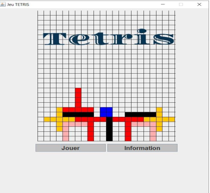

# Representation
This application consists of a grid of n lines and m columns and which contains shapes of different colors which are placed randomly and the goal then is to sort them so that they give a homogeneous shape we occupy the month of possible spaces.

## Design Pattern
- MVC.
- Factory.

## Application.

.
